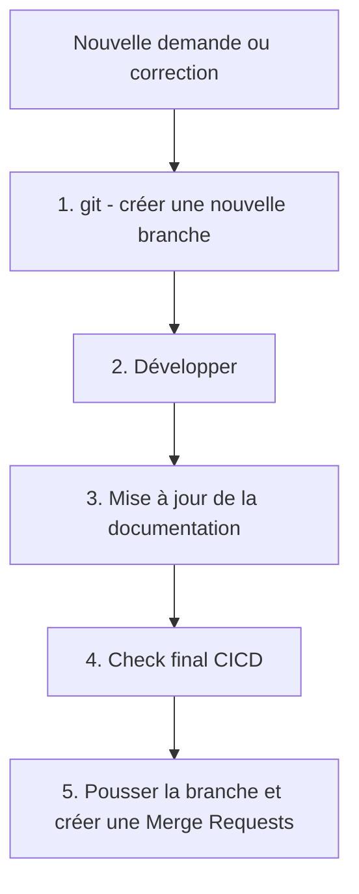

# plateforme-data-demo-dbt
Projet DBT

# Architecture de DBT

L'architecture de DBT essaie de coller le plus possible aux bonnes pratiques DBT:
https://docs.getdbt.com/guides/best-practices/how-we-structure/1-guide-overview

Le dossier Stage contient des modèles qui reconsituent les sources de données. 
Dans le cas des sources de données un peu compliquées qui nécessitent des jointures en plus du renommage, le stage est divisé en deux.
Une première couche, base, qui renomme et filtre les colonnes nécessaires aux modèles.
Une deuxième couche, stage, qui réalise les jointures pour dénormaliser les tables de la sources.

Le dossier DWH, qui correspond à INTERMEDIATE dans les bonnes pratiques DBT, contient les modèles avec une vue métier prêt à être analyser.
Enfin une dernière couche de datamart servira à dispacher la donnée la rendre prête pour la BI ou l'analyse.

# Marqueur dans le code
--?? = Question non résolue
--!! = Décision prise
--@@ = Action à mener
--## = Colonne commentée et donc non sélectionnée pour être remontée dans le modèle (et ainsi réduire la complexité des modèles et le volume de données.)

# entrepot

- [0) Development process](#0-development-process)
- [1) Prerequisites installation](#1-prerequisites-installation)
- [2) Installation](#2-installation)
- [3) Command help](#3-command-help)

# Linter SQL 

Pour maintenir une syntaxe d'écriture SQL universelle, nous utilisons le linter SQLFluff avec la librairie **pre-commit** 
qui nous permet d'exécuter le linter lors de notre commit.
la librairie python "pre-commit" sera installé lors du `invoke install`

## 0) Development process



### 1. git - créer une nouvelle branche

```bash
# Go to the main branch
git checkout main
# Update the branch with last modification
git pull origin main
# create new branch based on the main branch (ex: feat/dwh_f_facture)
git checkout -b feat/feature_name
```

### 2. Modèles DBT


Pour écrire un modèle DBT, utiliser un client SQL ou directement dans VS Code dans un modèle

Pour l'exécuter, utiliser la commande `invoke build-model <model_name>`.
Pour savoir quels modèles sont à exécuter, la commande `invoke check-all` vous les liste et vous donne la commande à exécuter.

### 3. Documentation

Pour simplifier le travail de documentation, la commande suivante génère le fichier yml de documentation
```bash
invoke doc-model <model_name>
```

Pour gagner du temps, il est possible de combiner le build et le doc avec la commande : 
```bash
invoke build-doc-model <model_name>
```

### 5. Check final

Pour améliorer la qualité du code poussé sur github, il y a quelques vérifications faites en local. Il s'agit en gros de s'assurer que les modèles modifiés tournent, et que leurs enfants niveau + 1 tournent également.

```bash
invoke check-all
```

### 5. Push your branch and create a Merge Request

```bash
# Add all changed files 
git add .
# Save the current state of your work
git commit -m 'feat(feature_name): description'
# Deploy your change on Gitlab
git push origin <your_branch_name>
```

Après cela, créer une Merge Request sur GitHub
Des tests automatiques se lanceront (ils rejouent le check-all joué au préalable en local)

## 1) Prerequisites installation

- Utiliser [Visual Studio Code](https://code.visualstudio.com/).
- Installer [conda](https://docs.conda.io/en/latest/miniconda.html)
- Cloner [le repo](https://github.com/effidic/plateforme-data-demo-dbt.git)

:warning: **Important:** Ne pas cloner dans un repertoire sous One drive ou autres cloud.

### Installation de Conso

**Sous Windows**

Depuis un invite de commande (cmd.exe) :

```bash
curl https://repo.anaconda.com/miniconda/Miniconda3-latest-Windows-x86_64.exe --output Miniconda3.exe

start /wait "" Miniconda3.exe /InstallationType=JustMe /RegisterPython=1 /AddToPath=1 /S /D=%UserProfile%\Miniconda3

del Miniconda3.exe
```

Pour tester, redémarrer l'invite de commande et exécuter:
```bash
conda
``` 


## 2) Installation

- Créer un fichier `.env` à la racine du projet avec ce contenu :
```text
KEYFILE_PROJECT_ID="plateforme-data-demo"
KEYFILE_CLIENT_EMAIL="python-etl@plateforme-data-demo.iam.gserviceaccount.com"
KEYFILE_CLIENT_ID="112498737287542299109"
KEYFILE_CLIENT_X509_CERT_URL="https://www.googleapis.com/robot/v1/metadata/x509/python-etl%40plateforme-data-demo.iam.gserviceaccount.com"
KEYFILE_PRIVATE_KEY=xxxxxxxxxxx
KEYFILE_PRIVATE_KEY_ID=xxxxxxxxxxxx
```

Remplacer les variables KEYFILE_PRIVATE_KEY et KEYFILE_PRIVATE_KEY_ID par les clés du compte de service 

- Installer invoke:
```bash
pip install invoke
```

- Ouvrir un terminal, à la racine du projet, et lancer la commande :
 Cette commande entrainera l'importation des variables d'environnement et le lancement de `dbt deps`
```bash
invoke install
```
*Il peut être nécessaire de désactiver des plugins tels que DBT Power User pendant l'installation*

- Installer la librairie "pre-commit":
```bash
pre-commit install
```

## 2) Installation hors Invoke 
:warning: Ce mode d'installation comporte les risques de ne pas utiliser les mêmes versions de librairie que les autres développeurs, il doit être utiliser pour des cas exceptionnels.
Si pour des besoins particuliers, vous devez vous passer d'invoke, alors vous devez vous-même : 
  - Installer dbt
```bash
pip install dbt_bigquery
``` 
  - Installer les dépendances dbt
```bash
dbt deps
``` 
  - Charger les variables d'environnement avant de pouvoir utiliser dbt
```bash
source .env
``` 

-----

## 3) Command help

- Build un model/snapshot DBT (compile , run , test)
```bash
invoke build-model <model_name>
# invoke build-model dwh_f_facture
```

- Génère (ou fusionne) un fichier yml de description pour un modèle
```bash
invoke doc-model <model_name>
# invoke doc-model dwh_f_facture
```

- Dernière étape de vérification avant de push le code sur github
```bash
invoke check-all
```

- Générer la doc et la mettre sur un webserveur [127.0.0.1:8080](127.0.0.1:8080).
```bash
invoke preview-doc
```
